# Домашнее задание к занятию «Продвинутые методы работы с Terraform»

### Цели задания

1. Научиться использовать модули.
2. Отработать операции state.
3. Закрепить пройденный материал.


### Чек-лист готовности к домашнему заданию

1. Зарегистрирован аккаунт в Yandex Cloud. Использован промокод на грант.
2. Установлен инструмент Yandex CLI.
3. Исходный код для выполнения задания расположен в директории [**04/src**](https://github.com/netology-code/ter-homeworks/tree/main/04/src).
4. Любые ВМ, использованные при выполнении задания, должны быть прерываемыми, для экономии средств.

------
### Внимание!! Обязательно предоставляем на проверку получившийся код в виде ссылки на ваш github-репозиторий!
Убедитесь что ваша версия **Terraform** ~>1.12.0
Пишем красивый код, хардкод значения не допустимы!

------

### Задание 1

1. Возьмите из [демонстрации к лекции готовый код](https://github.com/netology-code/ter-homeworks/tree/main/04/demonstration1) для создания с помощью двух вызовов remote-модуля -> двух ВМ, относящихся к разным проектам(**marketing** и **analytics**) используйте `labels` для обозначения принадлежности.  В файле *cloud-init.yml* необходимо использовать переменную для ssh-ключа вместо хардкода. Передайте ssh-ключ в функцию `template_file` в блоке `vars ={}` .
Воспользуйтесь [**примером**](https://grantorchard.com/dynamic-cloudinit-content-with-terraform-file-templates/). Обратите внимание, что ssh-authorized-keys принимает в себя **список**, а не **строку**.
3. Добавьте в файл *cloud-init.yml* установку **nginx**.
4. Предоставьте скриншот подключения к консоли и вывод команды ```sudo nginx -t```, скриншот консоли ВМ yandex cloud с их метками. Откройте `terraform console` и предоставьте скриншот содержимого модуля. Пример:
    ```
    > module.marketing_vm
    ```

------
В случае использования MacOS вы получите ошибку "Incompatible provider version" . В этом случае скачайте remote модуль локально и поправьте в нем версию template провайдера на более старую.

### Решение 1

Я сделал **local-module**

.\
├── [cloud-init.yml](task1/cloud-init.yml)\
├── [global_variables.tf](task1/global_variables.tf)&nbsp;&nbsp;&nbsp;&nbsp;&nbsp;&nbsp;&nbsp;&nbsp;&nbsp;&nbsp;# Значения переменных для проекта\
├── [main.tf](task1/main.tf)&nbsp;&nbsp;&nbsp;&nbsp;&nbsp;&nbsp;&nbsp;&nbsp;&nbsp;&nbsp;&nbsp;&nbsp;&nbsp;&nbsp;&nbsp;&nbsp;&nbsp;&nbsp;&nbsp;&nbsp;&nbsp;&nbsp;&nbsp;&nbsp;&nbsp;&nbsp;&nbsp;&nbsp;# Вызов модулей (root)\
├── [providers.tf](task1/providers.tf)\
├── [terraform.tfvars](task1/terraform.tfvars)&nbsp;&nbsp;&nbsp;&nbsp;&nbsp;&nbsp;&nbsp;&nbsp;&nbsp;&nbsp;&nbsp;&nbsp;&nbsp;&nbsp;# Значения переменных `key = "value"`\
└── modules/&nbsp;&nbsp;&nbsp;&nbsp;&nbsp;&nbsp;&nbsp;&nbsp;&nbsp;&nbsp;&nbsp;&nbsp;&nbsp;&nbsp;&nbsp;&nbsp;&nbsp;&nbsp;&nbsp;&nbsp;&nbsp;&nbsp;&nbsp;# Папка со всеми модулями\
&nbsp;&nbsp;&nbsp;&nbsp;&nbsp;&nbsp;&nbsp;&nbsp;&nbsp;└── zagotovka_count/ # Конкретный модуль\
&nbsp;&nbsp;&nbsp;&nbsp;&nbsp;&nbsp;&nbsp;&nbsp;&nbsp;&nbsp;&nbsp;&nbsp;&nbsp;&nbsp;&nbsp;&nbsp;&nbsp;├── [main.tf](task1/modules/zagotovka_count/main.tf)&nbsp;&nbsp;&nbsp;&nbsp;&nbsp;&nbsp;&nbsp;&nbsp;&nbsp;&nbsp;&nbsp;# Описание ресурсов (логика модуля)\
&nbsp;&nbsp;&nbsp;&nbsp;&nbsp;&nbsp;&nbsp;&nbsp;&nbsp;&nbsp;&nbsp;&nbsp;&nbsp;&nbsp;&nbsp;&nbsp;&nbsp;├── [variables.tf](task1/modules/zagotovka_count/variables.tf)&nbsp;&nbsp;&nbsp;&nbsp;&nbsp;# Входные параметры модуля\
&nbsp;&nbsp;&nbsp;&nbsp;&nbsp;&nbsp;&nbsp;&nbsp;&nbsp;&nbsp;&nbsp;&nbsp;&nbsp;&nbsp;&nbsp;&nbsp;&nbsp;├── [outputs.tf](task1/modules/zagotovka_count/outputs.tf)&nbsp;&nbsp;&nbsp;&nbsp;&nbsp;&nbsp;# Данные, которые модуль отдает наружу\
&nbsp;&nbsp;&nbsp;&nbsp;&nbsp;&nbsp;&nbsp;&nbsp;&nbsp;&nbsp;&nbsp;&nbsp;&nbsp;&nbsp;&nbsp;&nbsp;&nbsp;└── [providers.tf](task1/modules/zagotovka_count/providers.tf)

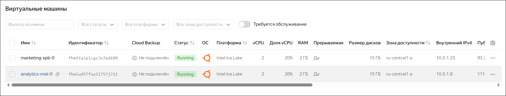

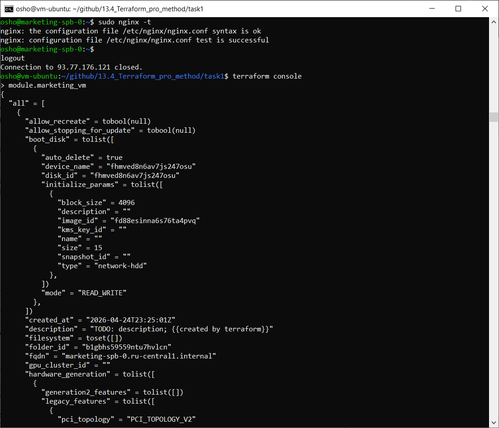

------

### Задание 2

1. Напишите локальный модуль vpc, который будет создавать 2 ресурса: **одну** сеть и **одну** подсеть в зоне, объявленной при вызове модуля, например: ```ru-central1-a```.
2. Вы должны передать в модуль переменные с названием **сети**, **zone** и **v4_cidr_blocks**.
3. Модуль должен возвращать в root module с помощью `output` информацию о `yandex_vpc_subnet`. Пришлите скриншот информации из `terraform console` о своем модуле. Пример:
    ```
    > module.vpc_dev
    ```
4. Замените ресурсы `yandex_vpc_network` и `yandex_vpc_subnet` созданным модулем. Не забудьте передать необходимые параметры сети из **модуля vpc** в модуль с виртуальной машиной.
5. Сгенерируйте документацию к модулю с помощью `terraform-docs`.
 
Пример вызова:

    ```
    module "vpc_dev" {
      source       = "./vpc"
      env_name     = "develop"
      zone = "ru-central1-a"
      cidr = "10.0.1.0/24"
    }
    ```

### Решение 2

.\
├── [cloud-init.yml](task2/cloud-init.yml)\
├── [global_variables.tf](task2/global_variables.tf)\
├── [main.tf](task2/main.tf)\
├── [providers.tf](task2/providers.tf)\
├── [terraform.tfvars](task2/terraform.tfvars)\
└── modules/\
&nbsp;&nbsp;&nbsp;&nbsp;&nbsp;&nbsp;&nbsp;&nbsp;├── vpc/\
&nbsp;&nbsp;&nbsp;&nbsp;&nbsp;&nbsp;&nbsp;&nbsp;│&nbsp;&nbsp;&nbsp;&nbsp;&nbsp;&nbsp;├── [main.tf](task2/modules/vpc/main.tf)\
&nbsp;&nbsp;&nbsp;&nbsp;&nbsp;&nbsp;&nbsp;&nbsp;│&nbsp;&nbsp;&nbsp;&nbsp;&nbsp;&nbsp;├── [outputs.tf](task2/modules/vpc/outputs.tf)\
&nbsp;&nbsp;&nbsp;&nbsp;&nbsp;&nbsp;&nbsp;&nbsp;│&nbsp;&nbsp;&nbsp;&nbsp;&nbsp;&nbsp;├── [providers.tf](task2/modules/vpc/providers.tf)\
&nbsp;&nbsp;&nbsp;&nbsp;&nbsp;&nbsp;&nbsp;&nbsp;│&nbsp;&nbsp;&nbsp;&nbsp;&nbsp;&nbsp;├── [README.md](task2/modules/vpc/README.md) # описание модуля, сделанного с помощью terraform-docs\
&nbsp;&nbsp;&nbsp;&nbsp;&nbsp;&nbsp;&nbsp;&nbsp;│&nbsp;&nbsp;&nbsp;&nbsp;&nbsp;&nbsp;└── [variables.tf](task2/modules/vpc/variables.tf)\
&nbsp;&nbsp;&nbsp;&nbsp;&nbsp;&nbsp;&nbsp;&nbsp;└── zagotovka_count/\
&nbsp;&nbsp;&nbsp;&nbsp;&nbsp;&nbsp;&nbsp;&nbsp;&nbsp;&nbsp;&nbsp;&nbsp;&nbsp;&nbsp;&nbsp;&nbsp;├── [main.tf](task2/modules/zagotovka_count/main.tf)\
&nbsp;&nbsp;&nbsp;&nbsp;&nbsp;&nbsp;&nbsp;&nbsp;&nbsp;&nbsp;&nbsp;&nbsp;&nbsp;&nbsp;&nbsp;&nbsp;├── [variables.tf](task2/modules/zagotovka_count/variables.tf)\
&nbsp;&nbsp;&nbsp;&nbsp;&nbsp;&nbsp;&nbsp;&nbsp;&nbsp;&nbsp;&nbsp;&nbsp;&nbsp;&nbsp;&nbsp;&nbsp;├── [outputs.tf](task2/modules/zagotovka_count/outputs.tf)\
&nbsp;&nbsp;&nbsp;&nbsp;&nbsp;&nbsp;&nbsp;&nbsp;&nbsp;&nbsp;&nbsp;&nbsp;&nbsp;&nbsp;&nbsp;&nbsp;└── [providers.tf](task2/modules/zagotovka_count/providers.tf)\

**Создание файла**

Перейти в директорию модуля и ввести команду:
```
terraform-docs markdown table --output-file README.md --output-mode inject .
```

Получившийся файл [README.md](task2/modules/vpc/README.md)

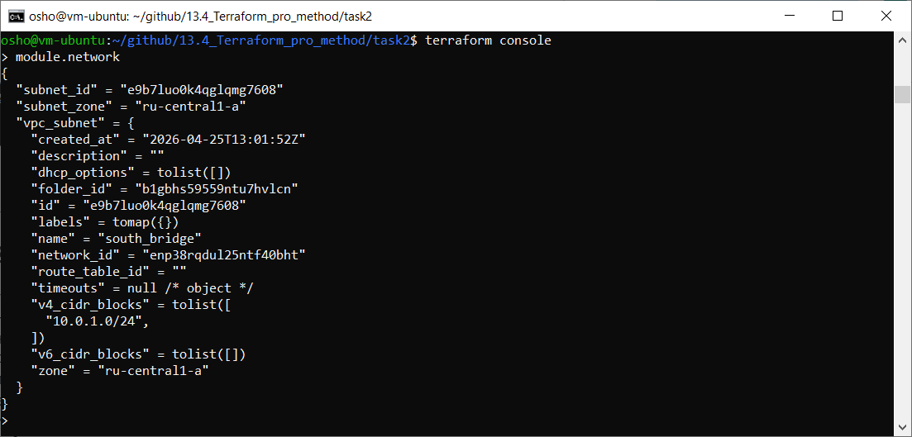

------

### Задание 3
1. Выведите список ресурсов в стейте.
2. Полностью удалите из стейта модуль `vpc`.
3. Полностью удалите из стейта модуль `vm`.
4. Импортируйте всё обратно. Проверьте `terraform plan`. Значимых(!!) изменений быть не должно.
Приложите список выполненных команд и скриншоты процессы.

### Решение 3

1. Вывод списка ресурсов
    ```
    terraform state list
    ```

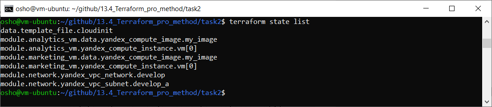

2. Удаление из .tfstate модуля в котором описано создание облачной сети
    ```
    terraform state rm module.network.yandex_vpc_subnet.develop_a
    ```

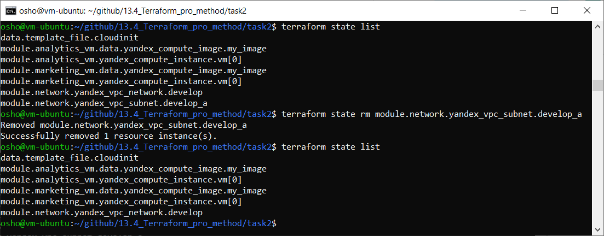

3. Удаление из .tfstate модуля vm
    ```
    terraform state rm module.analytics_vm.yandex_compute_instance.vm[0]
    ```

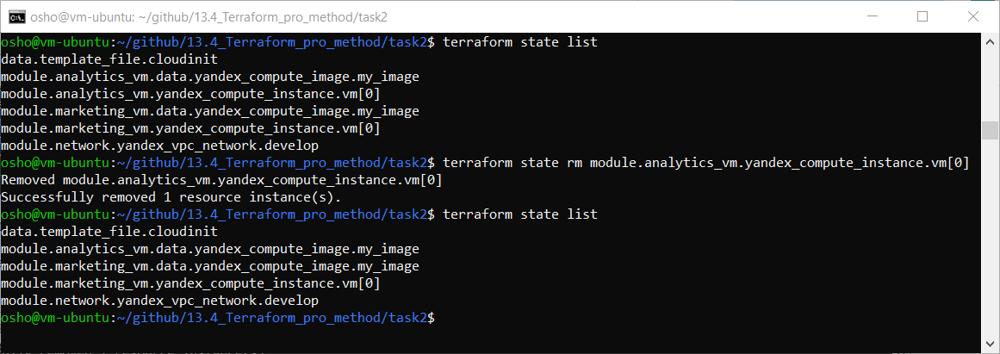

4. Проверка, какие ресурсы отсутствуют через `terraform plan`

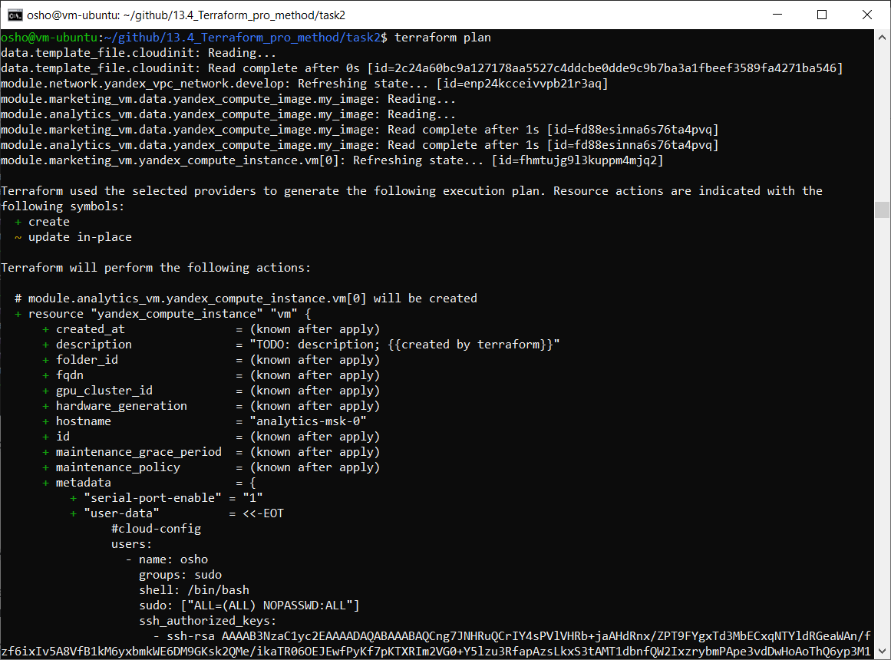

Ресурсы помеченные `+` в списке отсутствуют, т.к. terraform предлагает их создать.

отсутствуют:\
`module.analytics_vm.yandex_compute_instance.vm[0]`\
`module.network.yandex_vpc_subnet.develop_a`

Для возвращения ресурсов:\
`terraform import 'resource' 'id'`
```
terraform import 'module.analytics_vm.yandex_compute_instance.vm[0]' 'fhmhabcj2scrt1hcqheh'
```
```
terraform import 'module.network.yandex_vpc_subnet.develop_a' 'e9bkp8fr1obbn2u2cq1o'
```

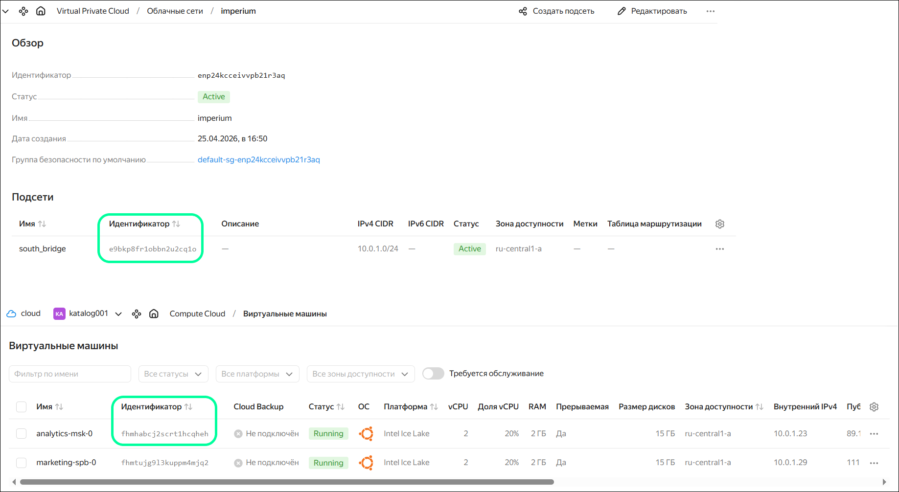

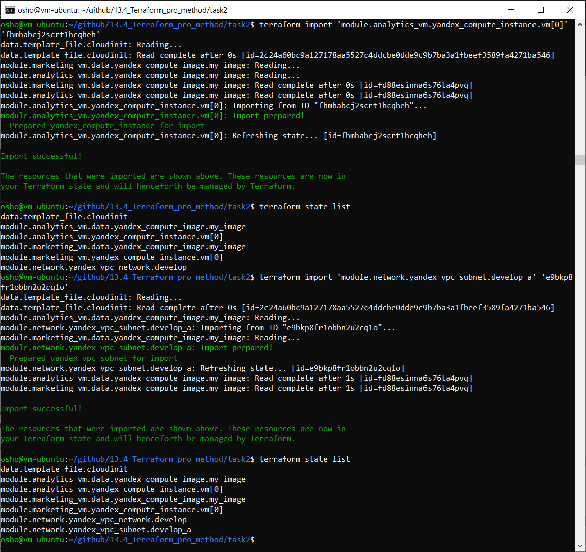

Ещё один вариант — сделать резервную копию и восстановить её

------

### Задание 4*

1. Измените модуль `vpc` так, чтобы он мог создать подсети во всех **зонах доступности,** переданных в переменной типа `list(object)` при вызове модуля.  
  
Пример вызова:
```
module "vpc_prod" {
  source       = "./vpc"
  env_name     = "production"
  subnets = [
    { zone = "ru-central1-a", cidr = "10.0.1.0/24" },
    { zone = "ru-central1-b", cidr = "10.0.2.0/24" },
    { zone = "ru-central1-c", cidr = "10.0.3.0/24" },
  ]
}

module "vpc_dev" {
  source       = "./vpc"
  env_name     = "develop"
  subnets = [
    { zone = "ru-central1-a", cidr = "10.0.1.0/24" },
  ]
}
```

Предоставьте код, план выполнения, результат из консоли **YC**.

### Решение 4*

`for <ПЕРЕМЕННАЯ_ДЛЯ_ИНДЕКСА>, <ПЕРЕМЕННАЯ_ДЛЯ_ЗНАЧЕНИЯ> in <СПИСОК> : ...`


`for_each = { for index, znachenie in var.subnets : "${s.zone}-${format("%02d", index + 1)}" => znachenie }`

Сначала идёт индекс, а потом значение (`0 ru-central1-a`)

`=>` — преобразование list в map

.\
├── [main.tf](task4/main.tf)\
├── [providers.tf](task4/providers.tf)\
├── [variables.tf](task4/variables.tf)\
└── vpc/\
&nbsp;&nbsp;&nbsp;&nbsp;&nbsp;&nbsp;&nbsp;&nbsp;├── [main.tf](task4/vpc/main.tf)\
&nbsp;&nbsp;&nbsp;&nbsp;&nbsp;&nbsp;&nbsp;&nbsp;└── [providers.tf](task4/vpc/providers.tf)

[Документация по командам YC для subnet](https://yandex.cloud/ru/docs/vpc/cli-ref/subnet/)

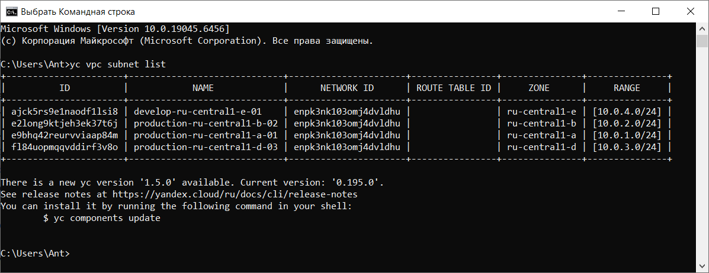

------

### Задание 5*

1. Напишите **модуль** для создания **кластера** managed БД Mysql в Yandex Cloud с **одним** или **несколькими**(2 по умолчанию) **хостами** в зависимости от переменной `ha=true` или `ha=false`. Используйте ресурс `yandex_mdb_mysql_cluster`: передайте **имя кластера** и **id сети**.
2. Напишите модуль для создания базы данных и пользователя в уже существующем **кластере** managed БД Mysql. Используйте ресурсы `yandex_mdb_mysql_database` и `yandex_mdb_mysql_user`: передайте **имя базы данных**, **имя пользователя** и **id кластера** при вызове модуля.
3. Используя оба модуля, создайте **кластер example** из одного хоста, а затем добавьте в него **БД test** и **пользователя app**. Затем измените переменную и превратите сингл хост в кластер из 2-х серверов.
4. Предоставьте **план** выполнения и по возможности результат. Сразу же удаляйте созданные ресурсы, так как кластер может стоить очень дорого. Используйте минимальную конфигурацию.

### Решение 5*

.\
├── [main.tf](task5/main.tf)\
├── [providers.tf](task5/providers.tf)\
├── [variables.tf](task5/variables.tf)\
├── module_cluster_db/\
│&nbsp;&nbsp;&nbsp;&nbsp;&nbsp;&nbsp;├── [main.tf](task5/module_cluster_db/main.tf)\
│&nbsp;&nbsp;&nbsp;&nbsp;&nbsp;&nbsp;├── [outputs.tf](task5/module_cluster_db/outputs.tf)\
│&nbsp;&nbsp;&nbsp;&nbsp;&nbsp;&nbsp;├── [providers.tf](task5/module_cluster_db/providers.tf)\
│&nbsp;&nbsp;&nbsp;&nbsp;&nbsp;&nbsp;└── [variables.tf](task5/module_cluster_db/variables.tf)\
└── module_db_user/\
&nbsp;&nbsp;&nbsp;&nbsp;&nbsp;&nbsp;&nbsp;&nbsp;&nbsp;├── [main.tf](task5/module_db_user/main.tf)\
&nbsp;&nbsp;&nbsp;&nbsp;&nbsp;&nbsp;&nbsp;&nbsp;&nbsp;├── [providers.tf](task5/module_db_user/providers.tf)\
&nbsp;&nbsp;&nbsp;&nbsp;&nbsp;&nbsp;&nbsp;&nbsp;&nbsp;└── [variables.tf](task5/module_db_user/variables.tf)

Создание кластера с переменной `ha=false`

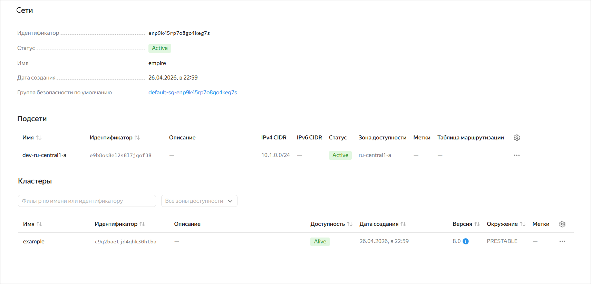

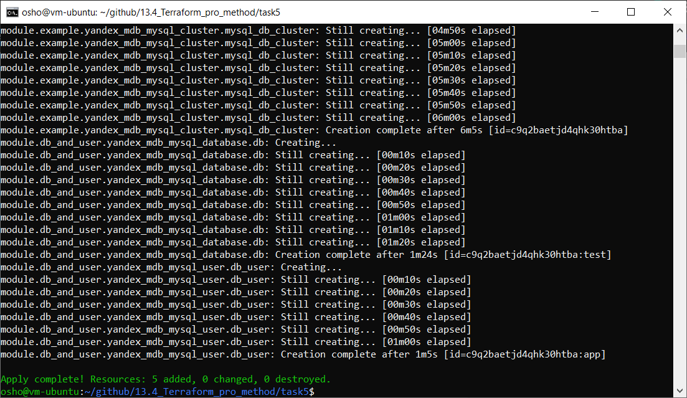

Такая схема у меня получилась:

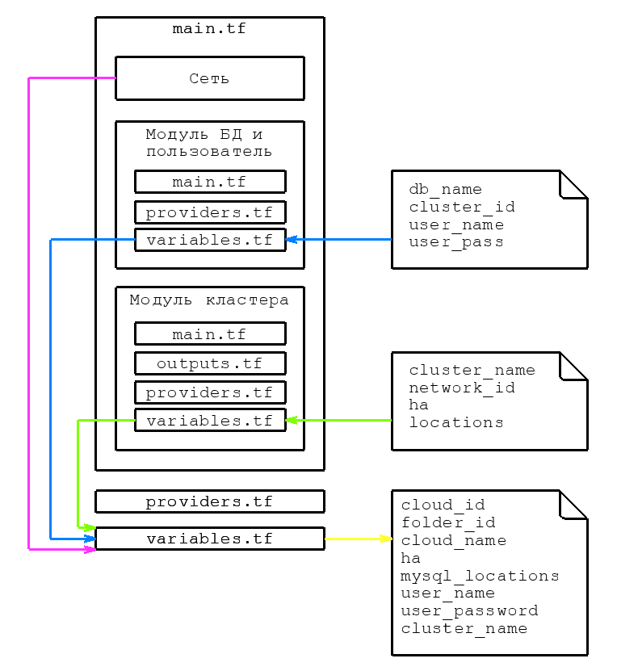

[terraform plan](files/terraform_plan_ha1) c переменной `ha=false`

[terraform plan](files/terraform_plan_ha2) c переменной `ha=true`

------

### Задание 6*
1. Используя готовый yandex cloud terraform module и пример его вызова(examples/simple-bucket): https://github.com/terraform-yc-modules/terraform-yc-s3 .
Создайте и не удаляйте для себя s3 бакет размером 1 ГБ(это бесплатно), он пригодится вам в ДЗ к 5 лекции.


### Решение 6*

*здесь должно быть что-то*

------

### Задание 7*

1. Разверните у себя локально vault, используя docker-compose.yml в проекте.
2. Для входа в web-интерфейс и авторизации terraform в vault используйте токен "education".
3. Создайте новый секрет по пути http://127.0.0.1:8200/ui/vault/secrets/secret/create
Path: example  
secret data key: test 
secret data value: congrats!  
4. Считайте этот секрет с помощью terraform и выведите его в output по примеру:
```
provider "vault" {
 address = "http://<IP_ADDRESS>:<PORT_NUMBER>"
 skip_tls_verify = true
 token = "education"
}
data "vault_generic_secret" "vault_example"{
 path = "secret/example"
}

output "vault_example" {
 value = "${nonsensitive(data.vault_generic_secret.vault_example.data)}"
} 

Можно обратиться не к словарю, а конкретному ключу:
terraform console: >nonsensitive(data.vault_generic_secret.vault_example.data.<имя ключа в секрете>)
```
5. Попробуйте самостоятельно разобраться в документации и записать новый секрет в vault с помощью terraform. 

### Решение 7*

*здесь должно быть что-то*

------

### Задание 8*
Попробуйте самостоятельно разобраться в документаци и с помощью terraform remote state разделить root модуль на два отдельных root-модуля: создание VPC , создание ВМ . 

### Решение 8*

*здесь должно быть что-то*